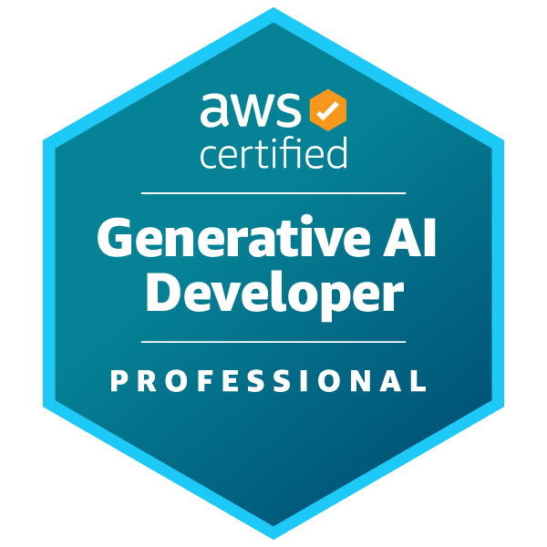

# Youngsun Joung · 정영선

<a href="https://youngsun-joung.web.app/">
<picture>
<source media="(prefers-color-scheme: dark)" srcset="https://readme-typing-svg.demolab.com?font=Fira+Code&amp;size=16&amp;pause=1200&amp;color=F2F2F2&amp;center=true&amp;vCenter=true&amp;width=420&amp;lines=AI+Engineer+%C2%B7+AWS+GenAI+%26+Deployment%3BLLM+%C2%B7+RAG+%C2%B7+Agent+Systems">

</picture>
</a>

[Portfolio](https://youngsun-joung.web.app/) · [LinkedIn](https://www.linkedin.com/in/youngsun-joung-5b0584345) · [Velog](https://velog.io/@ys2357/posts) · joungyoungsun20@gmail.com

 

---

I'm an AI engineer at **Megazone Cloud's AI Architect Unit**, with an M.S. in Mathematics from Korea University.

> Currently exploring: agentic AI systems, cloud-native ML infrastructure, and full-stack AI deployment.

---

<h3> Experience</h3>
<ul>
<li><strong>Megazone Cloud</strong>
<ul><li>AI Architect Unit · Manager · 2026.02 – Present</li></ul>
</li>
<li><strong>Intalk</strong>
<ul><li>AI Engineer Intern · 2025.11 – 2026.01</li><li>Insurance analysis automation</li></ul>
</li>
</ul>

<h3> Certifications</h3>
<ul>
<li><strong>AWS Solutions Architect — Professional</strong>
<ul><li>Sep 2026</li></ul>
</li>
<li><strong>AWS Generative AI Developer — Professional</strong>
<ul><li>Mar 2026 · GenAI Early Adopter badge</li></ul>
</li>
</ul>

### Tech Stack

| Area | Technologies |
|---|---|
| **AWS · GenAI & Deployment** |     |
| **AI Frameworks** |   |
| **Languages** |   |
| **App Frameworks** |    |
| **Other Cloud** |   |
| **Development Tools** |     |

### Projects

- **[GEOPage](https://github.com/gyurili/2025-GEO-Project)**
  - 생성형 AI 기반 소상공인 상세페이지 자동 생성
  - **고용노동부 장관상 (자유과제 우수상)** · 제7회 K-Digital Training Hackathon
  - `LangChain` · `FastAPI`

Other Projects

| Project | Description |
|---------|-------------|
| [RFPilot](https://github.com/gyurili/2025-LLM-Project) | RFP 문서 요약·질의응답 RAG 서비스 |
| [Pill Detection](https://github.com/codeit-Al-Project1/pill_detection_ai) | YOLOv8 기반 알약 객체 탐지 |
| [Compare-AI](https://github.com/YS-2357/compare-ai) | 여러 LLM의 응답 비교·요약 |
| [Coding Test](https://github.com/YS-2357/Coding_Test) | Python algorithm archive |

---

<h3> Education</h3>
<ul>
<li><strong>Korea University</strong>
<ul><li>M.S. Mathematics · GPA 4.24 / 4.5</li><li>Thesis: <em>Representations of the Temperley–Lieb Algebra</em></li></ul>
</li>
<li><strong>Inha University</strong>
<ul><li>B.S. Mathematics · GPA 3.90 / 4.5</li></ul>
</li>
<li><strong>Codeit AI Engineer Sprint</strong>
<ul><li>Completed · 2025</li></ul>
</li>
</ul>

<h3> Awards</h3>
<ul>
<li><strong>7th K-Digital Training Hackathon</strong>
<ul><li>Minister of Employment and Labor Award</li><li>3rd / 389 teams</li></ul>
</li>
<li><strong>Mathematics Competition for University Students in Korea</strong>
<ul><li>대학생 수학 경시대회 · Bronze · 2013</li><li>Korean Mathematical Society</li></ul>
</li>
</ul>

### GitHub Activity

<table>
<tr>
<td width="50%" align="center">
<picture>
<source media="(prefers-color-scheme: dark)" srcset="https://github-stats-extended.vercel.app/api?username=YS-2357&amp;hide_border=true&amp;title_color=FF9900&amp;theme=dark&amp;show_icons=true&amp;hide_rank=true&amp;icon_color=FF9900">

</picture>
</td>
<td width="50%" align="center">
<picture>
<source media="(prefers-color-scheme: dark)" srcset="https://github-stats-extended.vercel.app/api/top-langs/?username=YS-2357&amp;hide_border=true&amp;title_color=FF9900&amp;theme=dark&amp;layout=compact&amp;langs_count=6">

</picture>
</td>
</tr>
</table>

Language distribution reflects public repository contents, not proficiency.
